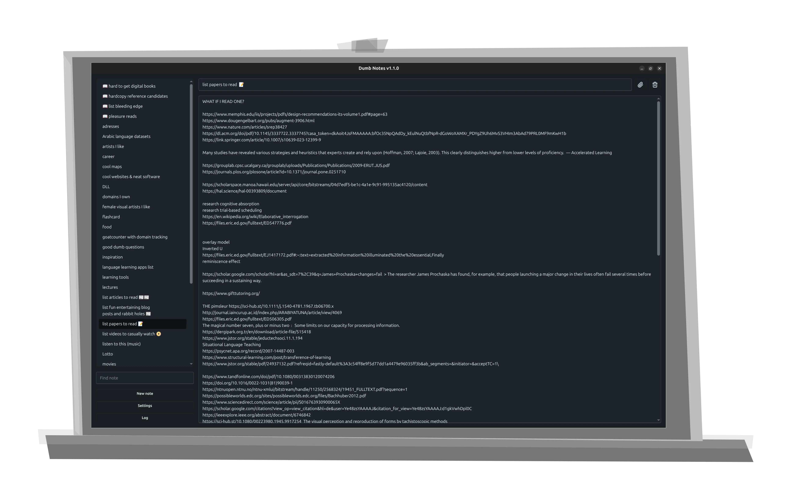

# dumb-notes

## an extremely simple, extremely plaintext, local note-taking app for notes where fancy templating only distracts



Minimal plaintext note-taker (Electron + Vite + Vue + Tailwind/DaisyUI). Notes live as `.txt` files in a single user-chosen folder.

- Sidebar (right): search + list + sort dropdown (no subfolders).
- Main pane: title field + body textarea, autosave (debounced), external edit prompts, delete via command palette.

## Prerequisites
- Node 18+ (recommended 20+)
- npm

## Quick Start

### Install
```bash
npm install
```

### Development

**Option 1** - Using `just` (recommended):
```bash
just dev
```

**Option 2** - Manual (3 separate terminals):

**Terminal 1** - Main process (watch mode):
```bash
npm run dev:main
```

**Terminal 2** - Renderer dev server:
```bash
npm run dev:renderer
```

**Terminal 3** - Launch Electron:
```bash
npm run start:dev
```

The app will hot-reload when you edit Vue files. Main process changes require restarting Terminal 3 (or `just dev`).

### Build .deb Package
```bash
npm run package:deb
```

Output: `release/dumb-notes_1.0.0_amd64.deb`

## Architecture

### Composables-First Design

The app uses Vue 3's Composition API with a **composables-first architecture** that separates business logic from UI:

- **Composables** (`src/renderer/src/composables/`) - Reusable business logic
- **Components** (`src/renderer/src/components/`) - Presentational UI (props + emits)
- **Services** (`src/renderer/src/services/`) - API/IPC abstraction layer
- **Utils** (`src/renderer/src/utils/`) - Pure utility functions

This design makes the codebase:
- **Testable** - Logic is isolated from Vue components
- **Reusable** - Composables work with any UI
- **Maintainable** - Clear separation of concerns
- **Portable** - Easy to adapt for different file formats (JSON, etc.)

### Folder Structure

```
dumb-notes/
├── src/
│   ├── main/                      # Electron main process (CommonJS)
│   │   ├── main.ts                # Window, IPC handlers, file operations
│   │   └── preload.ts             # Secure IPC bridge
│   └── renderer/                  # Vue 3 SPA (ESM)
│       ├── src/
│       │   ├── App.vue            # Orchestration (~70 lines)
│       │   ├── composables/       # Business logic
│       │   │   ├── useToasts.ts   # Toast notifications
│       │   │   ├── useSettings.ts # Settings management
│       │   │   ├── useNotes.ts    # Notes list + smart refresh
│       │   │   ├── useCurrentNote.ts # Note editing
│       │   │   └── useAutoSave.ts # Hybrid throttle + debounce
│       │   ├── components/        # Presentational UI
│       │   │   ├── ToastContainer.vue
│       │   │   ├── NotesList.vue
│       │   │   ├── NoteEditor.vue
│       │   │   └── SettingsModal.vue
│       │   ├── services/
│       │   │   └── notesApi.ts    # IPC wrapper
│       │   ├── utils/
│       │   │   └── validation.ts  # Title/filename validation
│       │   └── types/
│       │       └── global.d.ts
│       ├── index.html
│       └── vite.config.ts
├── dist/
│   ├── main/                      # Compiled Electron code
│   └── renderer/                  # Built Vue app
└── package.json
```

### Auto-Save Strategy

Uses a **hybrid throttle + debounce** approach (inspired by Obsidian):

- **Throttle**: Saves every 2 seconds max while typing (prevents data loss)
- **Debounce**: Saves 500ms after pausing (responsive to edits)
- **Immediate**: Title changes save instantly (for renames)

This eliminates editor lag during fast copy-paste/deletion while ensuring data safety.

### Reusability for Future Projects

The architecture is designed to be reused for similar apps (e.g., JSON-based file managers):

**Fully Reusable (copy as-is):**
- All composables (`useToasts`, `useSettings`, `useAutoSave`)
- Utils (`validation.ts`)

**80% Reusable (minor tweaks):**
- `useNotes.ts` - Change file extension filter
- `useCurrentNote.ts` - Update serialization format
- `notesApi.ts` - Swap IPC implementation

**UI-Specific (replace with new designs):**
- All `.vue` components
- App.vue orchestration

## Available Scripts

| Script | Description |
|--------|-------------|
| `npm run dev:renderer` | Start Vite dev server on :5173 |
| `npm run dev:main` | Compile main process in watch mode |
| `npm run start:dev` | Launch Electron connected to dev server |
| `npm run build:main` | Compile main process to `dist/main/` |
| `npm run build:renderer` | Build renderer to `src/renderer/dist/` |
| `npm run build` | Full production build (renderer + main + copy) |
| `npm run package:deb` | Build + create .deb package |
| `npm run package:appimage` | Build + create AppImage |
| `npm start` | Build main and run Electron |
| `npm run clean` | Remove all build artifacts |
| `npm run typecheck` | Run Vue type checking |
